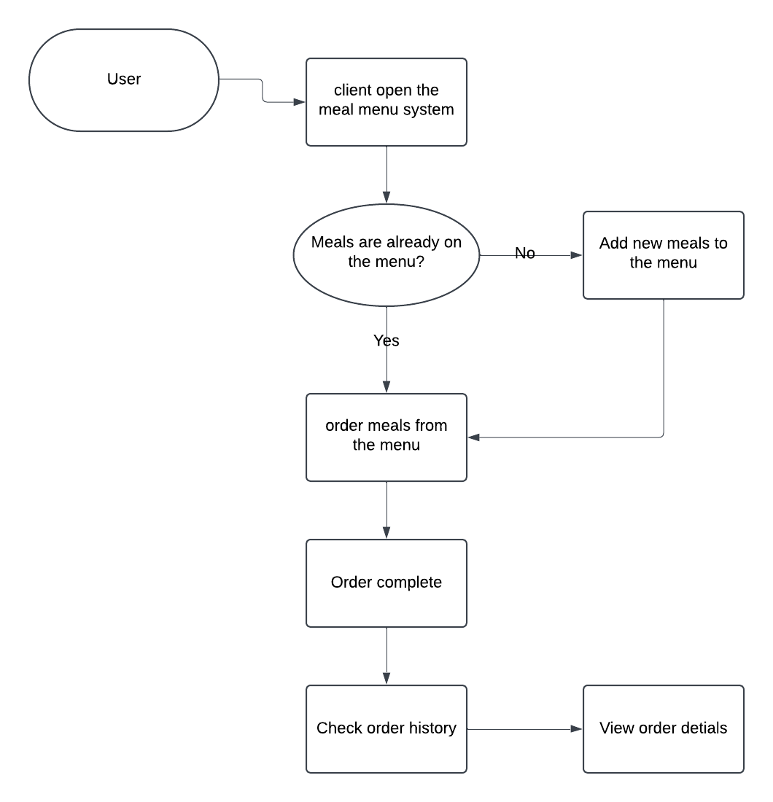
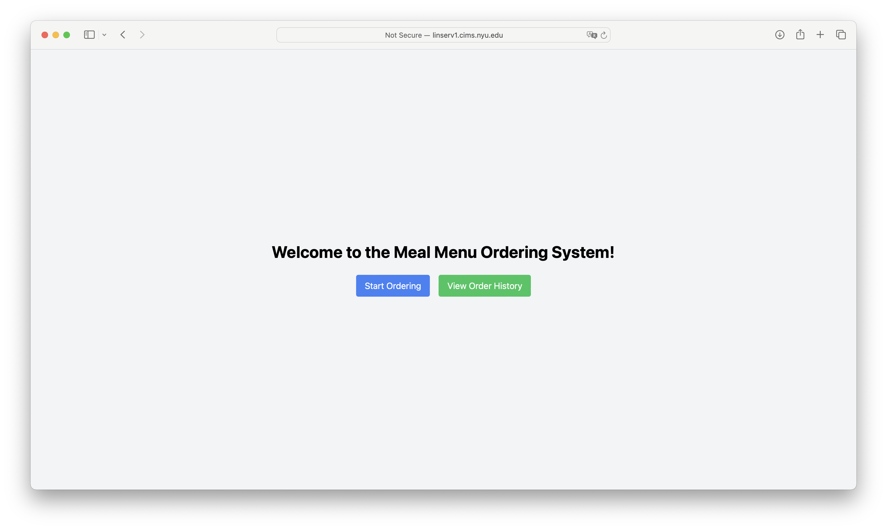
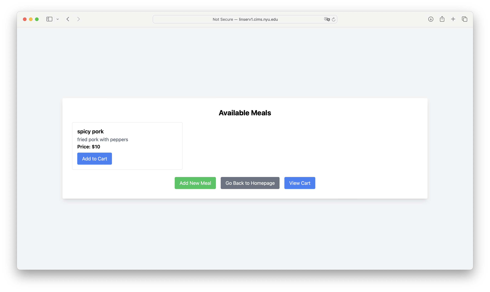
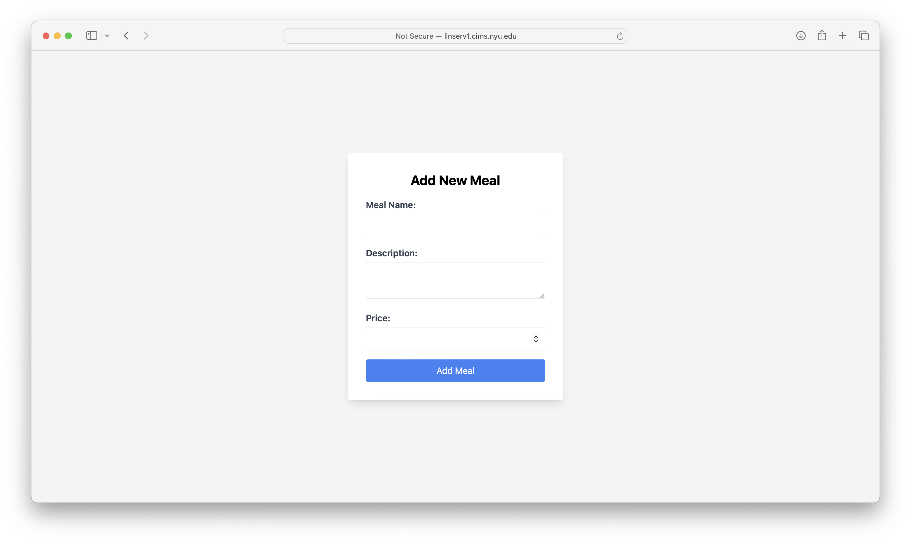
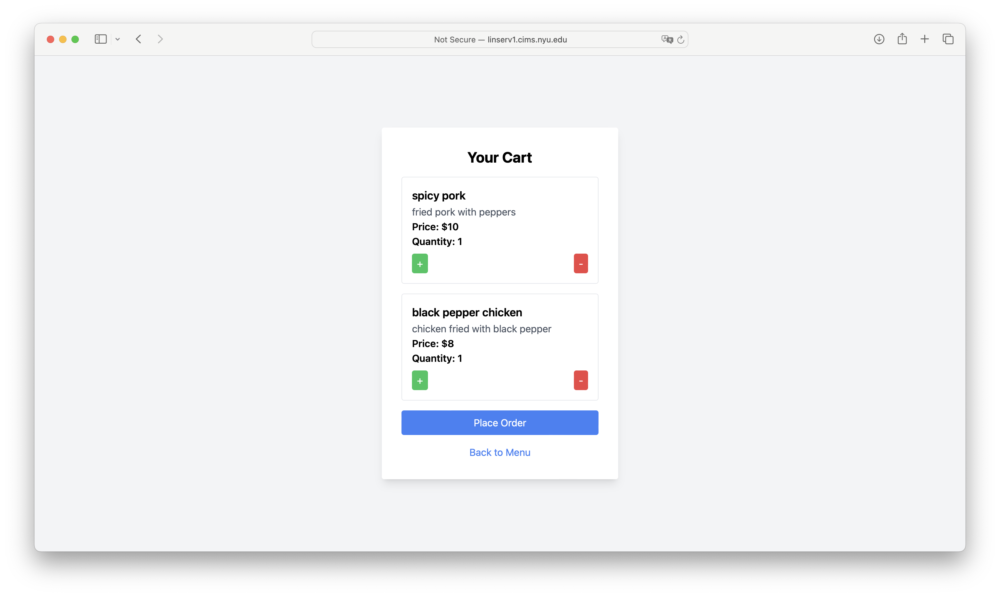
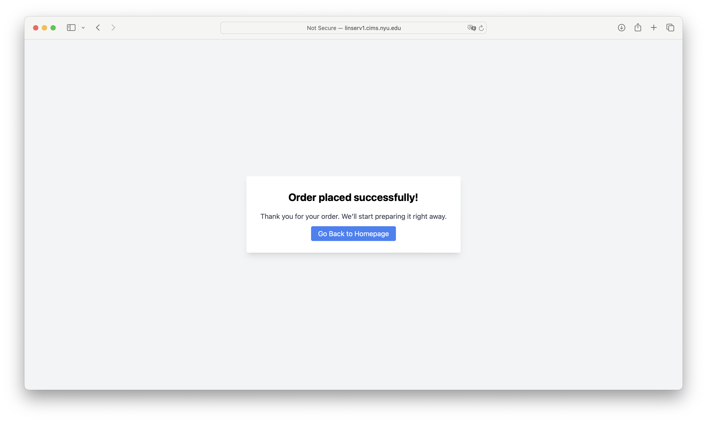
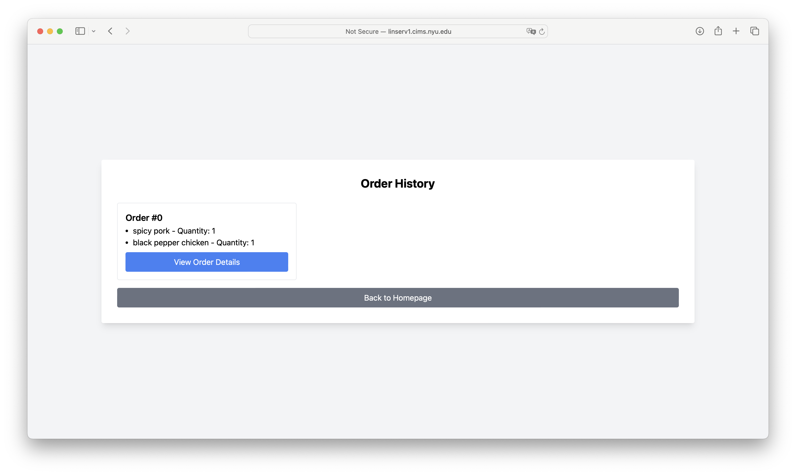
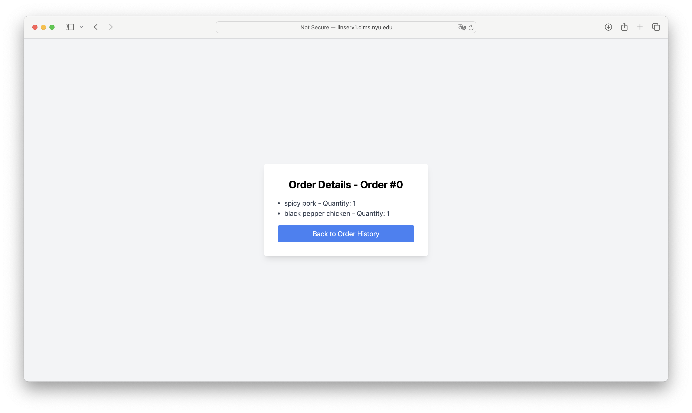

# Specification Phase Exercise

A little exercise to get started with the specification phase of the software development lifecycle. See the [instructions](instructions.md) for more detail.

## Team members

[Finnick Li](https://github.com/FinnickL)

## Stakeholders

Zirui Han -A busy college student who struggles to plan meals ahead of time.

Goals/Needs:
1. To save time by planning meals in advance.
2. To find all avalable meals in a menu, and add new meals to the menu.
4. To check the materials needed for each meal.

Problems/Frustrations:
1. Struggles to come up with meal ideas regularly.
2. Often forgets ingredients when grocery shopping.
3. Finds it hard to balance nutritional goals with busy schedules.
4. Ends up wasting time thinking about what to eat.

## Product Vision Statement

A mobile app that helps individuals efficiently plan, track, and manage their meals while considering dietary preferences and nutritional needs.

## User Requirements

1. As **Zirui Han**, I want to create a weekly meal plan so that I can organize my meals ahead of time.
2. As **Jinling Chen**, I want to save my favorite recipes so that I can quickly access them later.
3. As **Shaohua Zhang**, I want to generate a grocery list based on my meal plan so that I don’t forget any ingredients.
4. As **Lei Wang**, I want to search for recipes by dietary preferences so that I can find meals suitable for my diet.
5. As **Fang Liu**, I want to track the nutritional information of each meal so that I can maintain my health goals.
6. As **Zhicheng Fu**, I want to log meals I’ve eaten so that I can monitor my daily food intake.
7. As **Xiangyang Li**, I want reminders for upcoming meals so that I can prepare on time.
8. As **Ning Ding**, I want a list of meals on a menu so that I can easily choose what I like to eat.
9. As **Ziyu Li**, I want to add notes to meals so that I can track modifications or preferences.
10. As **Xuancheng Liu**, I want to share meal plans with friends or family so that we can collaborate on meals.

## Activity Diagrams

UML diagrams:
As **Zhicheng Fu**, I want to log meals I’ve eaten so that I can monitor my daily food intake.
As **Ning Ding**, I want a list of meals on a menu so that I can easily choose what I like to eat.

Wireframes:

home - Home Page for Browsing Meals
Displays options to start ordering or view order history.

menu - Menu Page
Page displays available meals in a list or grid format, showing an image, name, description, price, and an "Add to Cart" button.

menu/add-meal - Page for Adding a New Meal to the Menu
Form page for creating a new meal item. Fields include meal name, description, price, and an option to upload an image.

menu/cart - Page for Viewing the Cart
Displays all selected meals with options to adjust quantities or remove items. Includes a "Place Order" button to finalize the order.

menu/cart/place-order - Page for Order Placement Confirmation
Displays order placed successfully and some thankful messages.

orders - Order History Page
Page displays a list of all previous orders. Each entry includes the order ID, date, and an option to "View Order Details."

orders/orer-detials
- Page for Viewing Specific Order Details
Page displays details of a specific order, including each meal name, quantity, and total cost.

## Clickable Prototype

published clickable prototype
[Finnick Li](http://linserv1.cims.nyu.edu:12197)